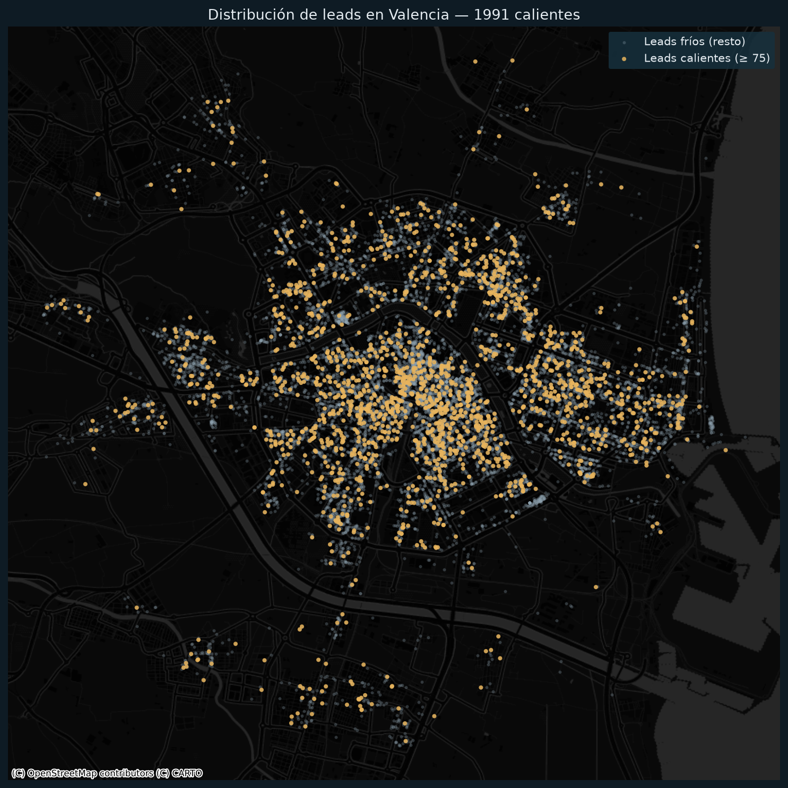

# Análisis de Leads — Tejido Comercial de Valencia

> De **15.160 negocios** en bruto a **1.991 leads cualificados y priorizados**.
> Proyecto end-to-end: construcción del dataset (scraping) → limpieza → modelo de *lead scoring* interpretable → visualización → (siguiente fase) Power BI.

**🔗 [Ver el dashboard interactivo en vivo »](https://lucapessatti.github.io/analisis-leads-valencia/dashboard/Analisis_Negocios_Valencia.html)**

**Fecha de captura de datos:** 23 de julio de 2026 · **Ámbito:** Valencia ciudad y área metropolitana.



---

## 1. El problema de negocio

Una agencia de marketing local necesita saber **a qué negocios de Valencia merece la pena contactar primero**. En lugar de comprar una lista genérica, se construye un **censo propio del mercado** y se puntúa cada negocio según lo atractivo que es como cliente potencial (*lead*).

La pregunta que responde el proyecto:
> *"De todos los negocios de Valencia, ¿cuáles son los mejores leads, dónde están y en qué sectores conviene concentrar el esfuerzo comercial?"*

---

## 2. Fuente de datos y método

- **Fuente:** fichas **públicas** de Google Maps (no datos personales).
- **Técnica:** scraping automatizado del **listado de resultados** (no ficha a ficha), que con emulación de escritorio ya expone todos los campos analíticos.
- **Cobertura:** matriz de **81 categorías × 6 anclas geográficas** por toda la ciudad, apurando cada búsqueda al tope de Maps (~120 resultados) para romper ese techo.
- **Deduplicación:** por el **identificador único de Google** de cada ficha (`place_id`), de modo que un negocio que aparece en varias búsquedas cuenta una sola vez.

> Nota de alcance: la fase de scraping es la parte más cercana a *data engineering*. El foco de este proyecto (y lo que se defiende como analista) es **el dato, el modelo de scoring y los insights**.

---

## 3. El dataset

`valencia_negocios_scored.csv` — **15.160 negocios únicos**, 18 columnas.

| Campo | Descripción |
|---|---|
| `id` | Identificador único de Google (clave de deduplicado) |
| `nombre` | Nombre del negocio |
| `sector` | Gran sector (de la búsqueda usada) |
| `busqueda` / `categoria` | Término buscado / categoría real de Google |
| `rating` / `resenas` | Valoración (0–5) y nº de reseñas |
| `precio_txt` / `precio_band` / `precio_medio_eur` | Precio (solo donde Maps lo muestra) |
| `distrito_aprox` / `dist_centro_km` / `nucleo_urbano` | Ubicación por zona y flag de núcleo urbano (≤6 km) |
| `direccion` / `lat` / `lng` | Dirección y coordenadas |
| `resena_destacada` | Una reseña representativa |
| `score` / `es_cadena_flag` | **Puntuación del lead (0–100)** y si es cadena |

**Distribución por sector (volumen total):**

| Sector | Negocios |
|---|---:|
| Hostelería | 3.484 |
| Servicios profesionales | 3.015 |
| Salud | 2.669 |
| Retail y hogar | 2.339 |
| Moda y complementos | 1.244 |
| Belleza | 1.112 |
| Panadería y dulces | 472 |
| Ocio y alojamiento | 436 |
| Joyería | 389 |

Cifras clave (núcleo urbano): **12.975 negocios**, **16 distritos**, **~5,1 M de reseñas**, **valoración media 4,46 ★**.

---

## 4. El modelo de *lead scoring*

Modelo **transparente y sumable**: cada negocio parte de **50 puntos** base y se le suma/resta según cada factor. Elegido a propósito frente a un modelo "caja negra" porque **cada punto es explicable**.

| Factor | Regla | Justificación |
|---|---|---|
| **Reputación** (rating) | ≥4,9 → +15 · ≥4,6 → +10 · ≥4,2 → +4 · <4,0 → −8 | Umbrales anclados a los **cuartiles reales** (mediana 4,6; P75 4,9). En Valencia casi todo está bien valorado, así que el listón se pone alto. |
| **Pyme local** (nº reseñas) | 25–300 → **+14** · <25 → +2 · 301–800 → +8 · >1.600 → −10 | El *sweet spot* (25–300) es la pyme consolidada. Los gigantes (miles de reseñas) se penalizan: son cadenas/turístico, el decisor está lejos. |
| **Cadena/franquicia** | Detectada por nombre → **−30** | Quien atiende no decide la contratación de marketing. |
| **Precio** | €€ / €€€ → +3 | Solo un **matiz** (peso pequeño), porque solo ~23 % de los negocios tiene el dato. |

Resultado acotado entre 0 y 100. **Leads "calientes" = score ≥ 75** → **1.991 leads en Valencia ciudad** (~15 % del censo urbano).

> El scoring está implementado en **pandas** (`df.apply`) con umbrales derivados de la propia distribución de los datos, no fijados "a ojo".

---

## 5. Insights principales

1. **Volumen ≠ calidad.** *Belleza* tiene la **mejor nota media** (70,3), pero *Salud* (621) y *Servicios profesionales* (486) generan **más leads en absoluto**. → Estrategia: por volumen, empezar por Salud/Servicios; por **tasa de acierto por llamada**, Belleza.

   | Sector | Score medio | Leads calientes |
   |---|---:|---:|
   | Belleza | 70,3 | 265 |
   | Salud | 67,9 | **621** |
   | Servicios profesionales | 66,3 | 486 |
   | Joyería | 64,8 | 34 |
   | Panadería y dulces | 64,8 | 23 |
   | Retail y hogar | 64,5 | 206 |
   | Moda y complementos | 61,2 | 92 |
   | Hostelería | 60,2 | 252 |
   | Ocio y alojamiento | 58,0 | 12 |

2. **Concentración geográfica:** los leads calientes se agrupan en **centro, L'Eixample y Ruzafa**; la periferia queda más dispersa (ver `mapa_leads.png`).
3. **Las cadenas caen solas al fondo** del ranking (Primark, Zara, McDonald's, MediaMarkt, Vitaldent…), lo que valida el factor de penalización.
4. **1.991 leads accionables** extraídos de 15.160 negocios en bruto: una cartera de prospección priorizada, no una lista genérica.

---

## 6. Limitaciones y fallos del análisis

*Fallos inherentes al análisis y a los datos (documentados con honestidad; es parte del rigor del proyecto).*

1. **La columna `sector` no siempre es la categoría real.** Viene del término de búsqueda, así que hay contaminación cruzada (p. ej. **ZARA aparece etiquetada como "Hostelería"** porque se coló en una búsqueda de comida). La columna `categoria` (la de Google) es más fiable; una v2 reclasificaría `sector` a partir de `categoria`.
2. **Duplicados por marca, no por local.** El deduplicado es por `place_id` (ubicación), así que las cadenas con varias sedes (p. ej. **MediaMarkt ×3**) cuentan como varios registros. Correcto para "locales", pero infla si se cuentan "marcas".
3. **Precio con cobertura baja (~23 %).** Google solo muestra precio en ~3.515 negocios (sobre todo hostelería). Por eso el precio pesa poco en el score y el análisis de precio se hace sobre un subconjunto.
4. **519 negocios sin valoración.** No tienen `rating`; en esos casos el factor de reputación queda neutro.
5. **Distrito aproximado.** Asignado por cercanía de coordenadas al centroide del distrito, **no por límite administrativo**. Fiable en el núcleo, orientativo en los bordes.
6. **Contaminación del extrarradio.** El rastreo amplio arrastró ~2.185 negocios de municipios vecinos (Mislata, Xirivella…), marcados con `nucleo_urbano=False`. Aun así, el "distrito más cercano" les asigna un distrito de Valencia.
7. **Foto fija en el tiempo.** `rating` y `resenas` son del día de captura y cambian; además las reseñas tienen **sesgo de autoselección** (opina quien está muy contento o muy enfadado).
8. **El score no llega a 100.** Con el modelo sumable, el máximo real es ~82 (50+15+14+3). Es un **ranking relativo**, no un porcentaje absoluto.
9. **El nº de reseñas es un proxy imperfecto de tamaño** (un negocio pequeño puede tener muchas reseñas y viceversa).
10. **Sin datos de contacto.** Este dataset no incluye teléfono/email (se descartaron por no ser fiables desde el listado). Son "leads a investigar", no listos para llamar. *(La fase de activación con contacto enriquecido se aborda como proyecto aparte.)*
11. **El censo es una muestra grande, no un registro completo.** Maps limita cada búsqueda a ~120 resultados; la matriz de categorías × zonas lo mitiga, pero no garantiza el 100 % del padrón comercial.

---

## 7. Objeciones a anticipar (y cómo responderlas)

| Objeción | Respuesta |
|---|---|
| *"¿Es legal/ético el scraping?"* | Datos **públicos** de negocio (no personales), para análisis agregado. En producción respetaría ToS, `robots.txt` y límites de ritmo, o usaría la API oficial de Google Places. |
| *"Los umbrales del score son arbitrarios."* | Están **anclados a los percentiles reales** del dataset y el modelo es interpretable y ajustable. |
| *"¿Por qué el score no llega a 100?"* | Modelo aditivo transparente; es un **ranking relativo**. Se podría normalizar a 0–100, pero se mantiene en crudo para no perder trazabilidad. |
| *"La mala clasificación de sector rompe tu análisis por sectores."* | Reconocido; `categoria` (Google) es más fiable y una v2 reclasificaría a partir de ella. El impacto es marginal en las conclusiones agregadas. |
| *"Detectar cadenas por nombre falla."* | Heurístico consciente: pilla las grandes, puede escaparse alguna. Mejorable con lista mantenida o señal de "propietario". |
| *"Las valoraciones están sesgadas."* | Cierto; se usan como señal **direccional**, no como verdad absoluta. |
| *"¿Cómo de representativo es el censo?"* | Muestra grande (15k), no censo total, por el tope de Maps; mitigado con la matriz de búsquedas. |
| *"Es una foto fija."* | Válido a fecha de captura; el pipeline es reejecutable para actualizar. |

---

## 8. Visualizaciones

| Archivo | Qué muestra |
|---|---|
| `img/score_por_sector.png` | Score medio de lead por sector |
| `img/leads_por_sector.png` | Nº de leads calientes por sector |
| `img/mapa_leads.png` | Mapa geográfico de leads sobre Valencia (mapa base real) |
| `dashboard/Analisis_Negocios_Valencia.html` | Dashboard interactivo (KPIs, gráficas, mapa, explorador) |

**Estética:** fondo oscuro `#0e1b24`, acento ámbar `#e8b45c`, contexto neutro `#8fa3b0`, texto `#e6edf2`. Principio: contexto que se retira + un acento cálido.

---

## 9. Power BI

El CSV puntuado (`valencia_negocios_scored.csv`) alimenta un **informe en Power BI** (`dashboard/Dashboard_VLC.pbix`), con un **tema de marca propio** (`powerbi/tema_tierra_calida.json`) validado contra el esquema oficial de Microsoft. Previsto:
- **Mapa** de leads por distrito/sector con filtro por `score`.
- **Segmentadores** por sector, distrito, banda de precio y "solo núcleo urbano".
- **Medidas DAX:** nº de leads (`score ≥ 75`), score medio, tasa de leads calientes por sector.
- **Página de "cartera comercial":** tabla priorizada por score con enlace a Maps.

---

## 10. Stack técnico

- **Extracción:** Python + Playwright (scraping del listado de Maps).
- **Análisis:** pandas (limpieza, modelo de scoring, agregaciones).
- **Visualización:** matplotlib + contextily (mapas), dashboard HTML autónomo.
- **BI:** Power BI, con tema de marca propio en JSON.

### Estructura del repositorio
```
analisis-leads-valencia/
├── README.md
├── branding/
│   └── logo.png                          ← logo del proyecto
├── dashboard/
│   ├── Analisis_Negocios_Valencia.html   ← dashboard interactivo (censo)
│   └── Dashboard_VLC.pbix                ← informe Power BI
├── powerbi/
│   └── tema_tierra_calida.json           ← tema de marca para Power BI
├── src/
│   ├── 1_scraping.py      ← extracción de Google Maps
│   ├── 2_procesado.py     ← limpieza + distritos + precio (ETL)
│   ├── 3_analisis.py      ← modelo de lead scoring + visualizaciones
│   └── 4_dashboard.py     ← generación del dashboard HTML
├── data/
│   ├── valencia_negocios.csv          ← censo (entrada del scoring)
│   └── valencia_negocios_scored.csv   ← censo con score (salida)
└── img/
    ├── mapa_leads.png
    ├── score_por_sector.png
    └── leads_por_sector.png
```

### Reproducir el análisis
El flujo es `1_scraping → 2_procesado → 3_analisis → 4_dashboard`. El script reejecutable es **`src/3_analisis.py`**, que lee `data/valencia_negocios.csv`, calcula el score y regenera el CSV puntuado y las imágenes:
```bash
pip install pandas matplotlib contextily
python src/3_analisis.py
```
`1_scraping.py` y `2_procesado.py` son el pipeline que construyó el censo (requieren los datos crudos, no versionados).
